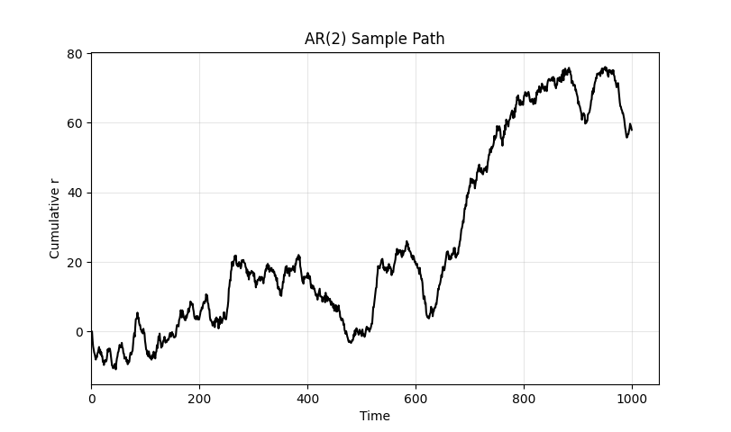
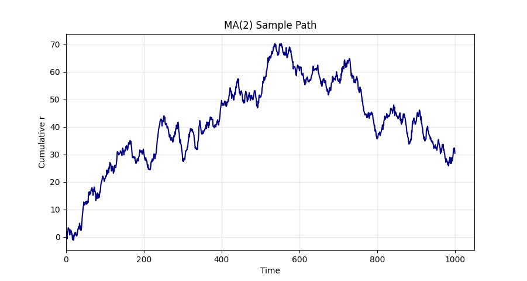
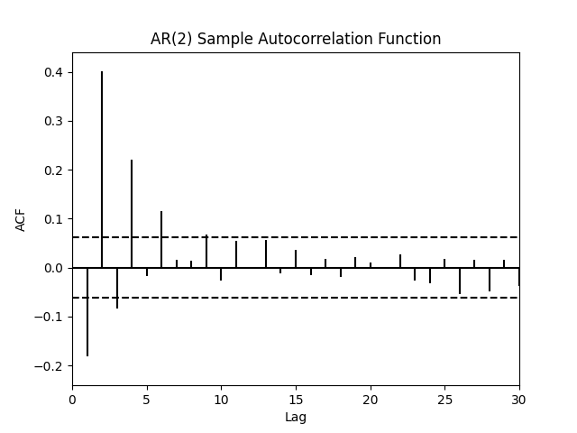
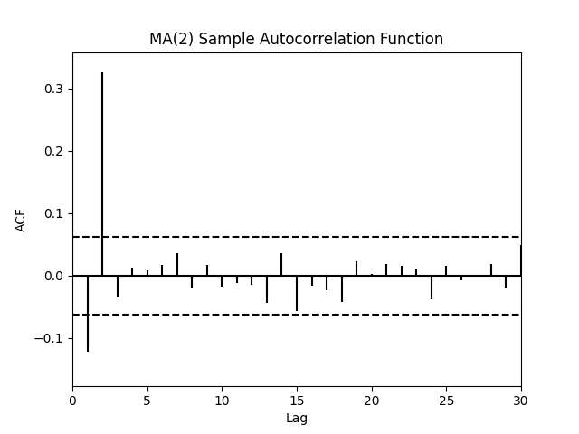
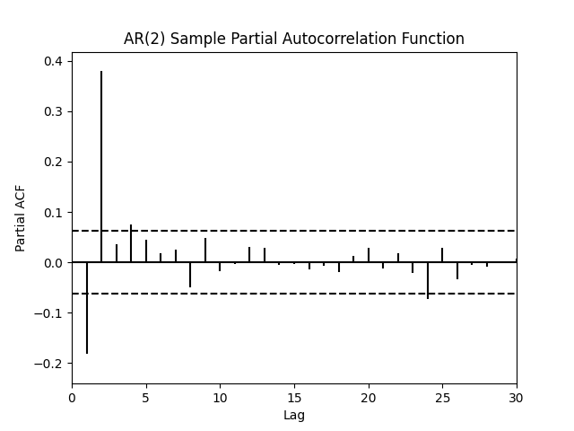
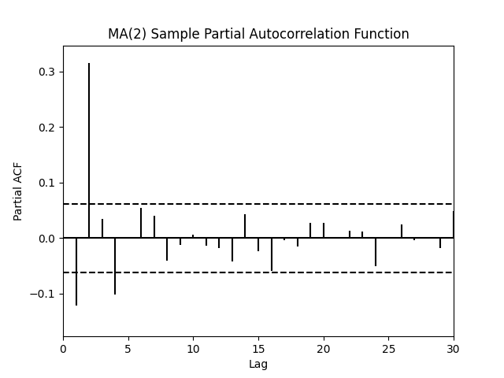

# Model Estimation and Selection: A Practical Approach

Making inferences from real-world data and building effective models is a challenging process. Since data rarely fits perfectly to theoretical expectations, models can deteriorate in performance over time. Therefore, we really need some approaches to help judgment.

For that reason, Monte Carlo simulations are helpful to provide testing environment for identification techniques. Under a controlled scenario, we can see which analytical methods most effective recover the correct parameters and how much uncertainty remains. 

Objective:
 - Given a model, estimate the appropriate order
 - Given a group of model, determine the best

## Order Determination 
### AR(2) Sample
In an AR(2) model, the current value of the time series is based on the two recent past values and a stochastic error term.

The model for the time series $r_t$ is defined as:
$$r_t = c_0+c_1\cdot r_{t-1}+c_2\cdot r_{t-2}+\epsilon_t$$
$$\epsilon_t \sim N(0, \sigma^2)$$

### MA(2) Sample

Moving average depends on previous lagged innovations.

MA(2), moving average of order 2, can be expressed as 

$$r_t = c + \epsilon_t + \theta_1 \epsilon_{t-1} + \theta_2 \epsilon_{t-2} $$

$$\epsilon_t \sim N(0, \sigma^2)$$

### Autocorrelation
It assesses the relationship of a time series with its own past values.

$$\gamma_k=Cov(r_t, r_{t-k})$$
$$\gamma_0=Var(r_t)$$
$$\rho_k=Corr(r_t,r_{t-k})=\gamma_k/\gamma_0$$

ACF and PACF are helpful to determine the appropriate order of an autoregressive (AR) model when analyzing time series data.
#### ACF

The autocorrelation function (ACF) measures the correlation between a time series and its own lagged values. It shows the overall correlation at each lag, including both direct and indirect effects.

The ACF of an AR(2) process gradually tails off, when the ACF of an MA(2) process shows a sharp cutoff after lag 2, lag 1 to 2 are significant with all higher lags being statistically insignificant.

#### PACF
The partial autocorrelation function (PACF) measures the direct correlation between a time series and its lagged values after removing the effects of all the shorter lags.

The PACF of an AR(2) process shows significant spikes at lags 1 and 2, then cuts off, which matches AR(2) theory.
Theoretically, the PACF of an MA(2) process should show gradual decay, but it doesn't show the clear parttern we expected here.

- [ ] **Future learning plan**: 
   1. Study the mathematical derivation of PACF
   2. Understand the Durbin-Levinson algorithm in depth
   4. Review and optimize the current implementation
   5. Add a section on AIC, BIC, or other information criteria
